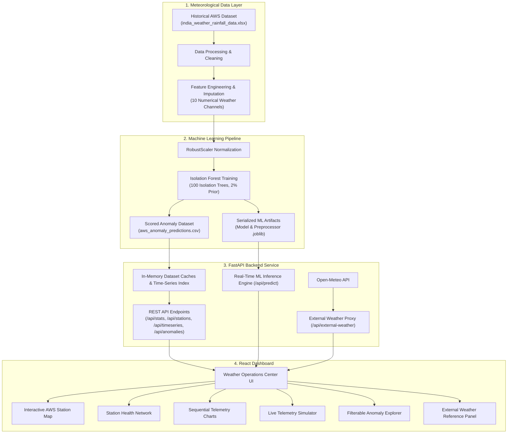

# AWS Anomaly Detection System

An intelligent meteorological quality-control and monitoring platform that uses Machine Learning to identify anomalies, sensor malfunctions, and unusual weather observations across Automatic Weather Stations (AWS).

---

## 🎯 Problem Statement

Automatic Weather Stations (AWS) are deployed across diverse geographic locations to continuously capture surface meteorological observations (temperature, atmospheric pressure, wind velocity, and rainfall). However:

- **Sensor Degradation & Hardware Faults**: Thermistors, barometers, and anemometers operate in severe environmental conditions, leading to calibration drift, voltage spikes, and frozen readings.
- **Unphysical & Inverted Telemetry**: Hardware glitches or ADC sensor faults can produce unphysical values (e.g., ambient temperatures exceeding $80^\circ\text{C}$ or minimum temperatures higher than maximum temperatures).
- **Extreme Meteorological Events**: Genuine severe weather events (e.g., cloudbursts, cyclonic depressions, squalls) produce extreme readings that deviate significantly from seasonal baselines.
- **Volume of Manual Quality Control**: Manually inspecting millions of daily sensor packets across hundreds of monitoring stations is impractical for meteorological operators.

This system provides automated anomaly detection and decision support by evaluating incoming observations against historical meteorological baselines.

---

## 💡 Our Solution

The AWS Anomaly Detection System acts as an automated diagnostic and monitoring platform:

1. **Telemetry Collection & Ingestion**: Ingests multi-sensor daily observations across temperature, wind velocity, barometric pressure, precipitation, and elevation.
2. **Historical Baseline Reference**: Leverages a comprehensive 10-year historical dataset across 406 Indian weather stations as the baseline norm.
3. **Multivariate ML Anomaly Detection**: Employs an **Isolation Forest** machine learning model to detect statistical outliers in multi-dimensional weather space without requiring labeled training data.
4. **Physical Sanity Rule Checks**: Augments statistical ML scores with deterministic meteorological sanity checks (e.g., physical temperature ceilings, diurnal temperature ordering, barometric thresholds).
5. **Interactive Mission-Control Dashboard**: Visualizes geographic station distributions, station health indices, sequential time-series trends, and filterable anomaly records.
6. **External Weather Reference**: Integrates real-time external weather data from **Open-Meteo** to provide an independent reference point for station coordinates.

> **Note**: This system is designed for observation monitoring, sensor quality control, and anomaly detection. It is not primarily a weather forecasting system.

---

## 🚀 Key Features

- 🗺️ **Interactive AWS Station Map**: Visualizes 406 Automatic Weather Stations across India using Leaflet.js, color-coded by operational status and anomaly severity tier. Click any station or map point to inspect coordinates and query external weather.
- 🩺 **Station Health Network**: Evaluates station quality scores ($0\%\text{--}100\%$) and classifies nodes into **Normal**, **Suspicious**, or **Anomaly** status based on historical anomaly rates.
- 📈 **Telemetry Analytics & Sequential Charts**: Interactive multi-sensor time-series graphs displaying historical daily trends for Average Temperature, Precipitation, Wind Speed, and Atmospheric Pressure alongside flagged anomaly markers.
- 🌲 **Unsupervised Isolation Forest Engine**: Evaluates multivariate weather observations and outputs continuous anomaly scores ($0.0\text{ to }1.0$) with transparent severity tiers (**LOW**, **MEDIUM**, **HIGH**).
- 🔍 **Anomaly Explorer**: Filterable directory of detected anomaly events with multi-criteria filtering by State, Station, Date Range, and Severity tier with plain-language ML diagnostic explanations.
- 📊 **Dataset KPI Analytics**: Real-time aggregated overview of total observations, normal vs. anomalous records, unique stations, administrative coverage, and atmospheric averages.
- ⚡ **Live ML Telemetry Simulator**: Interactive sandbox enabling operators to input custom sensor readings or load preset failure scenarios (e.g., Sensor Spike, Inverted Polarity, Monsoon Storm, Deep Depression) to test ML classification and physical diagnostics.
- 🌐 **External Weather Reference (Open-Meteo)**: Retrieves live external meteorological observations for side-by-side comparison against station readings.
- ⚡ **High-Performance FastAPI Backend**: Sub-millisecond indexed queries, in-memory analytical caches, and asynchronous REST endpoints.
- 📱 **Responsive Mission-Control UI**: Atmospheric dark-mode and high-contrast green aesthetic built with React 19, TypeScript, and Vanilla CSS.

---

## 🧠 Machine Learning Approach

```
                      [ Root Node: Temperature Partition ]
                                /             \
                        temp < 15°C         temp >= 15°C
                           /                     \
                   [ Severe Anomaly ]     [ Wind Speed Partition ]
                  (Path Length = 1)                 ...
                                              (Path Length = 14)
                                             [ Normal Observation ]
```

### Algorithm: Isolation Forest
The platform utilizes **Isolation Forest** (`sklearn.ensemble.IsolationForest`), an unsupervised tree ensemble designed specifically for anomaly detection.

### Why Isolation Forest?
1. **Unsupervised Learning**: Meteorological telemetry rarely has ground-truth fault labels. Isolation Forest learns normative distributions directly from unlabeled data.
2. **Sub-Tree Isolation Principle**: Anomalies have distinct attribute values, requiring fewer recursive partitions (shorter tree path lengths) to isolate from the rest of the data.
3. **Multivariate Anomaly Detection**: Identifies anomalous combinations across multiple sensor dimensions (e.g., normal temperature occurring alongside incompatible air pressure and rainfall).
4. **Computational Efficiency**: Operates with linear time complexity $O(t \cdot \psi \log \psi)$, enabling fast training over large datasets and sub-millisecond inference.

### Weather Parameters Used
The model trains and infers on 10 numerical features:
- `avg_temp` — Daily mean surface temperature (°C)
- `min_temp` — Daily minimum recorded temperature (°C)
- `max_temp` — Daily maximum recorded temperature (°C)
- `temp_range` — Diurnal Temperature Range ($max\_temp - min\_temp$)
- `wind_speed` — Surface wind velocity (km/h)
- `air_pressure` — Atmospheric pressure at station level (hPa)
- `rainfall` — 24-hour accumulated precipitation (mm)
- `elevation` — Station altitude above sea level (meters)
- `latitude` — Geographic coordinate (Decimal degrees)
- `longitude` — Geographic coordinate (Decimal degrees)

### Preprocessing Pipeline
- **Median Imputation (`SimpleImputer`)**: Replaces missing sensor telemetry values with feature medians to handle sensor dropouts without distorting distribution medians.
- **Robust Scaling (`RobustScaler`)**: Standardizes features using the median and Interquartile Range (IQR):
  $$x_{\text{scaled}} = \frac{x - Q_2(x)}{Q_3(x) - Q_1(x)}$$
  This prevents extreme outlier spikes (e.g., $87^\circ\text{C}$) from distorting scaling centers or variances.

### Anomaly Scoring & Severity Tiers
The model computes an anomaly score $s \in [0, 1]$ based on expected isolation tree path lengths:
$$s(x, n) = 2^{-\frac{E(h(x))}{c(n)}}$$

| Severity Tier | Anomaly Score Range | Description & Interpretation |
|---|---|---|
| **`NORMAL`** | $s < 0.50$ | Observation lies well within regular historical meteorological distribution. |
| **`LOW`** | $0.50 \le s < 0.58$ | Mild statistical isolation; within acceptable operational margin. |
| **`MEDIUM`** | $0.58 \le s < 0.70$ | Significant multivariate deviation; flagged for operator review. |
| **`HIGH`** | $s \ge 0.70$ | Severe anomaly or physical bounds violation; immediate attention recommended. |

---

## 🔄 System Workflow



---

## 🏗️ System Architecture

The application is structured into four decoupled layers:

1. **Frontend Presentation Layer** (`frontend/`):
   - Single Page Application built with **React 19**, **TypeScript**, and **Vite**.
   - Map rendering via **Leaflet.js** with CartoDB Voyager tiles.
   - SVG-rendered responsive time-series telemetry graphs.
   - Centralized typed API client with in-memory caching and request timeout handling.

2. **Backend API Layer** (`backend/`):
   - **FastAPI** application running with Uvicorn.
   - Pydantic models for strict input validation.
   - In-memory time-series indexing and pre-computed analytical aggregations for sub-millisecond query responses.
   - HTTP session connection pooling for external weather queries.

3. **Machine Learning Layer** (`ml/`):
   - Offline training pipeline in `train_anomaly_model.py`.
   - Real-time prediction and diagnostic scoring in `predict_anomaly.py`.
   - Serialized joblib artifacts for production inference.

4. **External Services**:
   - **Open-Meteo REST API**: Queried via backend proxy (with direct browser fallback) to retrieve ambient temperature, humidity, wind velocity, and precipitation for real-time reference.

---

## 🛠️ Technology Stack

### Frontend
- **Framework**: React 19 (`react`, `react-dom`)
- **Language**: TypeScript (`typescript`)
- **Build Tool**: Vite (`vite`, `@vitejs/plugin-react`)
- **Mapping**: Leaflet (`leaflet`, `@types/leaflet`)
- **Styling**: Vanilla CSS (Atmospheric Dark / Green Operations Design System)

### Backend
- **Framework**: FastAPI (`fastapi`)
- **ASGI Server**: Uvicorn (`uvicorn[standard]`)
- **Validation**: Pydantic (`pydantic`)
- **HTTP Client**: Requests (`requests`)

### Machine Learning & Data Processing
- **ML Framework**: Scikit-Learn (`scikit-learn`)
- **Data Analysis**: Pandas (`pandas`), NumPy (`numpy`)
- **Serialization**: Joblib (`joblib`)
- **Excel Processing**: OpenPyXL (`openpyxl`), Calamine (`python-calamine`)

### External Services & Deployment
- **Weather Reference**: Open-Meteo API
- **Deployment**: Render (Web Service for Backend, Static Site for Frontend)

---

## 📂 Project Structure

```
AWS-anomaly-detection/
├── backend/
│   ├── main.py                     # FastAPI application & REST endpoints
│   └── requirements.txt            # Python backend dependencies
├── data/
│   ├── raw/
│   │   └── india_weather_rainfall_data.xlsx  # Raw historical AWS dataset (970k rows)
│   ├── processed/
│   │   └── aws_anomaly_predictions.csv       # Pre-computed anomaly predictions
│   └── README.md                   # Dataset schema and profiling documentation
├── docs/
│   ├── API_DOCUMENTATION.md        # Detailed REST API specification
│   ├── ARCHITECTURE.md             # End-to-end system architecture & diagrams
│   ├── DATASET_DOCUMENTATION.md    # Summary of dataset features & attributes
│   ├── DEMO_FLOW.md                # Hackathon presentation & demonstration guide
│   └── ML_APPROACH.md              # Mathematical methodology & ML justification
├── frontend/
│   ├── public/                     # Static assets
│   ├── src/
│   │   ├── api/
│   │   │   └── client.ts           # Centralized typed API client & caching
│   │   ├── components/
│   │   │   ├── StationMap.tsx      # Interactive Leaflet AWS station map
│   │   │   ├── TelemetryCharts.tsx # Sequential SVG telemetry & anomaly chart
│   │   │   └── WeatherIcons.tsx    # SVG meteorological iconography
│   │   ├── App.tsx                 # Main dashboard UI & navigation tabs
│   │   ├── index.css               # Atmospheric design system tokens & styling
│   │   └── main.tsx                # React application entry point
│   ├── .env                        # Frontend environment configuration
│   ├── package.json                # Node dependencies & build scripts
│   ├── tsconfig.json               # TypeScript configuration
│   └── vite.config.ts              # Vite bundler configuration
├── ml/
│   ├── models/                     # Serialized ML artifacts (.joblib)
│   ├── src/                        # ML helper utilities
│   ├── data_analysis.py            # Exploratory data analysis & statistical checks
│   ├── predict_anomaly.py          # Real-time anomaly scoring class & diagnostics
│   ├── train_anomaly_model.py      # End-to-end Isolation Forest training pipeline
│   ├── requirements.txt            # Python ML training dependencies
│   └── README.md                   # ML pipeline documentation
├── index.html                      # Root HTML entry template
└── README.md                       # Project documentation
```

---

## 📊 Dataset

- **Primary Dataset**: `data/raw/india_weather_rainfall_data.xlsx` (and processed CSV `data/processed/aws_anomaly_predictions.csv`).
- **Source Attribution**: Kaggle Indian Meteorological / AWS Daily Weather & Rainfall Telemetry Archive.
- **Volume**: **970,339** records across **406 unique weather stations** covering **32 States/UTs** and **314 Districts**.
- **Timeframe**: January 1, 2015 to February 10, 2025 (~10 years of daily observations).
- **Available Fields**:
  - Temporal: `date_of_record`, `month`, `season`
  - Geographic: `station_name`, `state`, `district`, `latitude`, `longitude`, `elevation`
  - Meteorological: `avg_temp`, `min_temp`, `max_temp`, `wind_speed`, `air_pressure`, `rainfall`
  - ML Scored (Processed): `anomaly` (0 or 1), `anomaly_score` (0.0 to 1.0)

---

## 🔌 API / Backend

The backend provides REST endpoints documented via OpenAPI at `/docs`:

| Method | Endpoint | Description |
|---|---|---|
| `GET` | `/api/health` | Service health status and confirmation that ML model artifacts are loaded. |
| `GET` | `/api/stats` | Aggregated dataset KPIs (total records, anomalies count, stations requiring attention). |
| `GET` | `/api/stations` | Paginated station directory with real coordinates, health scores, and anomaly rates. |
| `GET` | `/api/timeseries` | Sequential daily multi-sensor telemetry stream for time-series charts with indexed matching. |
| `GET` | `/api/anomalies` | Multi-parameter filterable anomaly explorer with severity categorization and explanations. |
| `GET` | `/api/telemetry` | Statistical distributions (min, max, mean, std) and seasonal observation breakdown. |
| `POST` | `/api/predict` | Real-time single telemetry packet scoring, Isolation Forest evaluation, and physical diagnostics. |
| `GET` | `/api/external-weather` | Proxied real-time external weather observations from Open-Meteo with caching and retries. |

---

## 💻 Local Setup

### Prerequisites
- **Python**: Version 3.10 or higher
- **Node.js**: Version 18.0 or higher (with npm)
- **Git**

### 1. Clone the Repository
```bash
git clone https://github.com/ansitmaurya/AWS-anomaly-detection.git
cd AWS-anomaly-detection
```

### 2. Backend Setup
```bash
cd backend
pip install -r requirements.txt
```

Start the FastAPI backend server:
```bash
python -m uvicorn main:app --reload --host 127.0.0.1 --port 8000
```
*The backend will be running at `http://127.0.0.1:8000` (API documentation at `http://127.0.0.1:8000/docs`).*

### 3. (Optional) Model Retraining
If you wish to retrain the Isolation Forest model from the raw dataset:
```bash
cd ../ml
pip install -r requirements.txt
python train_anomaly_model.py
```

### 4. Frontend Setup
In a new terminal window:
```bash
cd frontend
npm install
npm run dev
```
*The frontend dashboard will be running at `http://localhost:5173`.*

---

## 🌐 Deployment

The system is configured for cloud deployment:
- **Backend**: Deployed as a Python Web Service on **Render**.
- **Frontend**: Deployed as a Single Page Application Static Site on **Render**.

Live Backend Service: `https://aws-anomaly-detection.onrender.com`

---

## 🔐 Environment Variables

### Frontend Configuration (`frontend/.env`)
| Variable | Description | Default / Example Value |
|---|---|---|
| `VITE_API_URL` | Base URL pointing to the active backend service | `https://aws-anomaly-detection.onrender.com` |
| `VITE_API_BASE_URL` | Alternate fallback base URL for backend API | `https://aws-anomaly-detection.onrender.com` |

*For local frontend development against a local backend, set `VITE_API_URL=http://127.0.0.1:8000`.*

---

## 🎯 SIH Relevance

This project directly addresses critical operational challenges in meteorological telemetry and weather station quality control:

1. **Scalable Monitoring of Distributed AWS Networks**: Provides unified visibility across 406 station nodes, reducing reliance on manual data validation.
2. **Early Sensor Malfunction Identification**: Flags hardware calibration drift, thermal polarity errors, and gauge blockages before compromised data corrupts forecasting models.
3. **Transparent & Explainable AI**: Combines machine learning isolation scores with physical domain diagnostics to give operators clear reasons for flagged telemetry.
4. **Spatial & Temporal Visualization**: Enables operators to quickly distinguish between isolated sensor faults and regional weather events through interactive map layers and sequential graphs.
5. **Independent External Verification**: Incorporates external ground-truth observations to cross-verify station readings.

---

## 🔮 Future Scope

- **Real-Time IoT / MQTT Streaming**: Integrating live AWS telemetry packet streams via MQTT or Kafka message brokers for sub-minute anomaly alerts.
- **Spatial Neighbor Cross-Validation**: Algorithms comparing target station observations against neighboring stations within geographic radii to verify microclimate variations vs. sensor dropouts.
- **Automated Webhook & SMS Alerts**: Configurable alerting rules to notify field technicians when a station's health score falls below operational thresholds.
- **Deep Learning Sequence Models**: Complementing Isolation Forest with temporal sequence architectures (e.g., LSTMs, Autoencoders) for multi-day anomaly trend forecasting.
- **Multi-Source Satellite & Radar Overlays**: Incorporating satellite cloud-cover imagery and Doppler weather radar overlays on the station map.

---

## ⚠️ Limitations

- **Historical Dataset Dependency**: Model baselines and statistical ranges reflect the historical patterns present in the 2015–2025 dataset.
- **Statistical Anomaly vs. Hardware Fault**: A high anomaly score denotes statistical rarity; operators must evaluate physical diagnostics to discern genuine extreme weather from electrical sensor failures.
- **Missing Sensor Data in Raw Telemetry**: Historical rainfall, wind speed, and air pressure records contain missing intervals that rely on median imputation during model evaluation.
- **External API Dependency**: Availability of the external reference panel depends on third-party Open-Meteo service availability and network connectivity.

---

## 👥 Team

**Team**: SIH Team [Add Team Name / Member Names]

---

## 📜 License

License: Not specified.