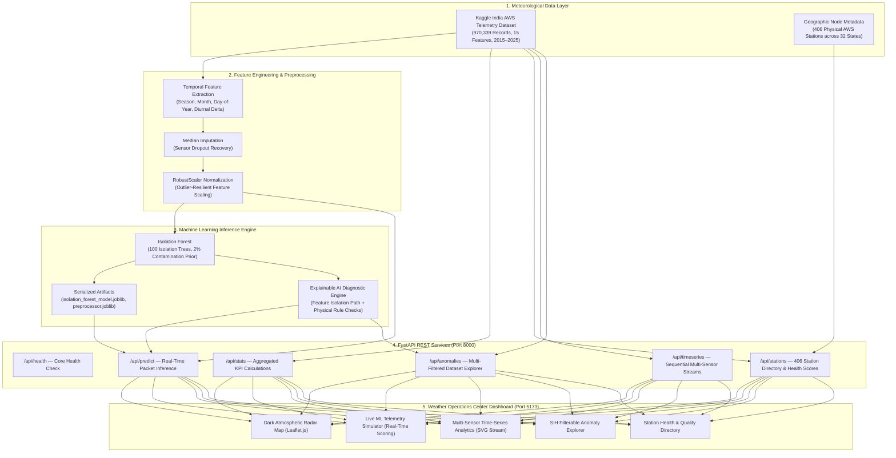

# System Architecture & Technical Specifications

This document outlines the architectural design, data pipelines, and component relationships of the **AI/ML-Based Intelligent Anomaly Detection System for Automatic Weather Stations (AWS)**.

---

## 🏗️ End-to-End System Pipeline

---

## 🔍 Detailed Component Responsibilities

### 1. Meteorological Data Layer
- **Source**: Kaggle India Weather & Rainfall Historical AWS Dataset (`india_weather_rainfall_data.xlsx`).
- **Volume**: 970,339 total observation rows across 10 years (2015–2025).
- **Physical Nodes**: 406 unique weather station locations across 32 Indian States and 314 districts, with precise geographic coordinates ($7.9833^\circ\text{N} - 34.0833^\circ\text{N}$, $68.8500^\circ\text{E} - 95.3833^\circ\text{E}$).

### 2. Feature Engineering & Preprocessing Pipeline
- **Core Numerical Features**:
  - `avg_temp` (Average surface temperature in °C)
  - `min_temp` (Daily minimum temperature in °C)
  - `max_temp` (Daily maximum temperature in °C)
  - `temp_range` ($max\_temp - min\_temp$)
  - `wind_speed` (Surface wind velocity in km/h)
  - `air_pressure` (Barometric surface pressure in hPa)
  - `rainfall` (Daily 24-hour precipitation in mm)
  - `elevation` (Altitude above sea level in meters)
  - `latitude` / `longitude` (Spatial coordinates)
- **Normalization**: `RobustScaler` scales features by median and interquartile range (IQR), preventing extreme outlier readings from skewing normalization baselines.

### 3. Machine Learning Inference Engine
- **Algorithm**: `scikit-learn.ensemble.IsolationForest`.
- **Hyperparameters**:
  - `n_estimators`: 100 decision trees
  - `contamination`: 0.02 (2.00% anomaly prior based on empirical meteorological sensor fault rates)
  - `max_samples`: 100,000 observations per tree partition
  - `random_state`: 42 for reproducible inference
- **Scoring Function**:
  $$s(x, n) = 2^{-\frac{E(h(x))}{c(n)}}$$
  Where $E(h(x))$ is the average path length of point $x$ over all isolation trees, and $c(n)$ is the average path length of unsuccessful searches in a Binary Search Tree of $n$ instances.
  - Scores $> 0.50$ indicate anomalous observations isolated near root nodes.
  - Scores $< 0.50$ represent typical meteorological conditions.

### 4. FastAPI REST Backend (`backend/main.py`)
- High-speed asynchronous Python service handling request validation via Pydantic schemas.
- Exposes clean, paginated endpoints to prevent large memory transfers to web clients.
- Incorporates physical domain rules (thermal sanity bounds, polarity inversion checks, pressure/wind thresholds).

### 5. Frontend Weather Operations Center (`frontend/src/`)
- Built with React 19, TypeScript, and Vite.
- Styled using a bespoke "Atmospheric Intelligence / Weather Operations Center" design system in vanilla CSS.
- Integrates Leaflet.js with CartoDB Dark Matter tile mapping and fine-calibrated smooth zoom physics.
